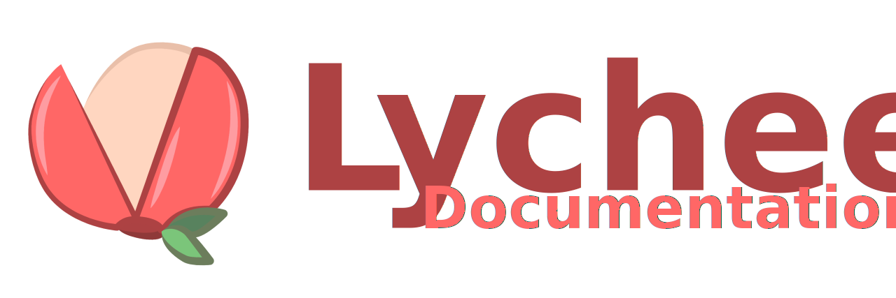

# Lychee

A **rust**-based documentation desktop application that allows the user to create **notes** and group them using **tags** rather than a filestructure-based system. Export user-defined **reports** for quick access of notes.

This application was inspired by my messy notes. I have a scratch notebook where I write anything on my mind, and having to search through this book full of commands leads to a nightmare. Thus, Lychee was born. A system in which the user can just write notes called **Nodes**, and the Lychee system sorts out where this note needs to go based on the **Tag** system. No more thinking about which file *X* information belongs in, and no more searching for a niche python script you stached *somewhere* in that /python folder. If the user wants a cheat sheet of all their notes on *X* language, they can create a **Report**, a view of all items categorized by a **Tag**. The possibilities are endless!

## Tech Stack 💻

**Front-End** ⤵
- Vite
- React
- TypeScript
- shadcn/ui

**Back-End** ⤵
- Tauri
- Rust
- SQLite

## Installation 📥

`Windows`: You can find the .exe and nsis file in releases
`Linux`: Releasing in 1.1.0
`MacOS`: Releasing in 1.1.0

## Usage & Customization 🔥

Check the wiki for Theming and Guides [right here](https://github.com/lilacdotdev/lychee/wiki)!

## Documentation 📖

Documentation available at [lychee](https://lychee.lilaccs.dev) or our [wiki](https://github.com/lilacdotdev/Lychee/wiki)!

## Feedback 📬

Report any bugs in the [issues](https://github.com/lilacdotdev/Lychee/issues) section above ⤴

If you have any feedback, please feel free to reach out at talk@lilaccs.dev

## Contributing 💖

Contributions are always welcome with much love! ❤️

This application is entirely open to any changes and plugins/themes/other are happily welcome!

## License 📜

This program is under the [MIT License](https://choosealicense.com/licenses/mit/), meaning you can make any modifications you wish. Feel free to go crazy!

I very happily encourage you to showcase any cool changes youve made in our threads up above! ⤴

## Authors 👥

Made w/ 💕 by:

- [@lilacdotdev](https://www.github.com/lilacdotdev) - Application Development
- [@adavidson](https://www.linkedin.com/in/adavidson) - Art/Logo & Themes
